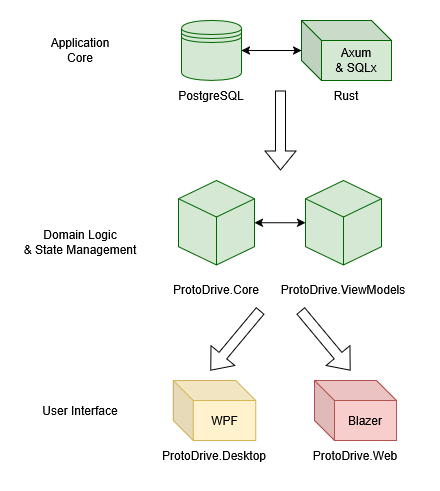

# Proto Drive: Distributed File Management System (In-Progress)

A Google Drive clone built with clear separation of concerns using a Rust-based RESTful API and C# shared domain logic.

---

## Project Status: Core Services Complete

The project is currently in the **Integration Phase** (Stage 3/4). The core RESTful API, authentication service, and platform-agnostic shared logic library are **mostly operational and complete**. Development is ongoing on the WPF Desktop client (Presentation Layer).

## Key Features & Achieved Requirements

The following requirements are fully implemented and available via the core RESTful API:

* **Authorization:** Elementary user registration and secure token-based authentication with JWT against the Rust backend.
* **File CRUD Operations:** Complete API support for managing files: **Upload, Download, Query, Delete**.
* **Detailed Metadata Retrieval:** For every file, the API successfully returns:
    * Name, Creation Time, Modification Time, Owner, and Editor.
* **Sync Foundation:** API hooks and database structures are established to support future remote-to-local folder synchronization.

---

# Architecture: A Three-Tiered, Scalable Design

The architecture was strategically designed to decouple the high-performance data service from the presentation layers, ensuring flexibility and maintainability.



> Here, green coloration denotes a well-developed component of the architecture, yellow denotes a project that's in development, and red marks unimplemented but planned components.

## 1. The Application Core (Rust)
The entire back-end is implemented in **Rust** using the **Axum** framework and **SQLx** (async Postgres driver). This choice ensures maximum performance, concurrency safety, and stability for the file management service.

* **Language:** Rust
* **Framework:** Axum
* **Database:** PostgreSQL (via SQLx)

PostgreSQL was chosen an established open source solution with no limitations, and the crate [`sqlx`](https://docs.rs/crate/sqlx/latest/features) was used for efficient and effective database interaction.
The application core is managed by the crate `storage`, asccessible here: [storage/](./storage/).

## Database design

The database schema was managed using sqlx migrations, an development approach that allows to set up and verify databases with lightning speed.
The migration files can be found [here](./storage/migrations/), but here's the overview:

```sql
-- *_users.sql
CREATE TABLE users (
    id UUID PRIMARY KEY DEFAULT gen_random_uuid(),
    login TEXT UNIQUE NOT NULL,
    phc TEXT NOT NULL,
    created_at TIMESTAMPTZ NOT NULL DEFAULT now()
);
```

```sql
-- *_files.sql
CREATE TABLE files(
    id UUID PRIMARY KEY DEFAULT gen_random_uuid(),
    name TEXT NOT NULL,
    path TEXT UNIQUE,
    owned_by UUID NOT NULL,
    edited_by UUID,
    deleted_by UUID,
    created_at TIMESTAMPTZ NOT NULL DEFAULT now(),
    edited_at TIMESTAMPTZ,
    deleted_at TIMESTAMPTZ,
    FOREIGN KEY (owned_by) REFERENCES users(id),
    FOREIGN KEY (edited_by) REFERENCES users(id),
    FOREIGN KEY (deleted_by) REFERENCES users(id)
);
```

```sql
-- *_configs.sql
CREATE TABLE configs(
    user_id UUID UNIQUE NOT NULL,
    sorted TEXT,
    ascending BOOLEAN NOT NULL DEFAULT TRUE,
    -- name -- Always visible
    created_at BOOLEAN NOT NULL DEFAULT TRUE,
    edited_at BOOLEAN NOT NULL DEFAULT TRUE,
    owned_by BOOLEAN NOT NULL DEFAULT TRUE,
    edited_by BOOLEAN NOT NULL DEFAULT TRUE,
    filtered BOOLEAN NOT NULL DEFAULT FALSE,
    FOREIGN KEY (user_id) REFERENCES users(id)
);
```

This set up is mostly self-explanatory, but warrants a general note on application logic.

For each registered user, a hash is genereted, later to be used to verify passwords.
This is done via a combination of crates [password_hash](https://docs.rs/password-hash/latest/password_hash/index.html) and [argon2](https://docs.rs/argon2/latest/argon2/).

Files are stored based on the UUID and the file UUID, and the `path` field remembers their location relative to a chosen 'root' directory.

Configs are meant to cary information about user's preferred view of files, such as column visibility, between different sessions.
Notably, this behaviour was not required by the task, so this table could have been avoided.

## 2. The Shared Logic Layer (C#)
ProtoDrive.Core and PrivateDrive.ViewModels librares contain all core business logic, ViewModels, and data formatting rules. It allows both the WPF and Blazor clients to share the exact same logic for:

* Authorization
* Data validation and parsing.
* State management

This includes projects [ProtoDrive.Core](./ProtoDrive/Core/) and [ProtoDrive.ViewModels](./ProtoDrive/ViewModels/) within the [ProtoDrive solution](./ProtoDrive/).

Besides obviously targeting the MVVM application architecture, these projects follow many of the modern practices:
- DI & IoC with Microsoft Extensions Host Builder
- typed services, featuring `HttpClient` and `IHttpClientFactory` with connection pooling
- a dedicated athorization handler
- a generic navigation service
- explicit serialization configuration

## 3. Presentation Layer (C# - In Development)
Designed for platform-specific rendering, utilizing the completed Shared Logic Layer.

* **Desktop Client:** C# / WPF. This is currently in development.
* **Web Client:** C# / Blazor (Future Stage)

# Feature Readiness Table

| Requirments   | Database | API | Core | ViewModels | Desktop | Blazer |
| ------------- | -------- | --- | ---- | ---------- | ------- | ------ |
| Authorization | ✔️       | ✔️  | ✔️   | ✔️         | ✔️      | ❌      |
| Cobinet       | ✔️       | ✔️  | ✔️   | ✔️         | ✔️      | ❌      |
| Attributes    | ✔️       | ✔️  | ✔️   | ✔️         | ✔️      | ❌      |
| Files CRUD    | ✔️       | ✔️  | ❌   | ❌         | ❌      | ❌      |
| Hide Columns  | ✔️       | ✔️  | ✔️   | ✔️         | ❌      | ❌      |
| Sync          | ⚠️       | ⚠️  | ❌   | ⚠️         | ❌      | ❌      |
| View .c, .jpg | ⚠️       | ⚠️  | ⚠️   | ⚠️         | ❌      | ❌      |
| Sort Files    | ✔️       | ✔️  | ⚠️   | ✔️         | ❌      | ❌      |
| Filter Files  | ✔️       | ✔️  | ⚠️   | ✔️         | ❌      | ❌      |


✔️ - feature is implemented
❌ - feature is unimplemented
⚠️ - feature is unnecessary on that layer